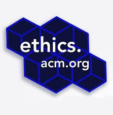

## Ethics in Software Engineering
One theme I often encountered in computer science courses is ethics. I would be asked how code is biased? Or whether certain software is ethical? For a long time I had no clue how code could be biased and I did not understand how ethics could be such a relevant topic in code. Considerably, early on I would be asked these questions in classes where the projects being coded were extremely basic programs such as a tic tac toe game or random number generator. As such the bigger picture did not really apply. Though while taking a class on software engineering I finally made the connection between software development and ethics. Turns out in real world applications, ethics plays a major role.

Ethical dilemmas can take multiple forms and have varying degrees depending on the project. One story that stuck out to me was the story of Bill Sourer in <a href="https://www.freecodecamp.org/news/the-code-im-still-ashamed-of-e4c021dff55e/"><i class="large github icon "></i>“The code I’m still ashamed of”</a>. In essence he created a web page that included a quiz which ultimately encouraged young girls to take a medicine whose side effects included depression and suicidal thoughts. This story revealed that ethical dilemmas can occur in code. When it comes to the ethics of software one needs to consider the physical, emotional, and intellectual consequences. The consequences of Sourer’s code was the informational influence it had in a medical manner. This ethical concept can be applied to a plethora of environments, from cybersecurity tools and penetration testing guidelines to coding of self-driving cars or missiles. In each of these situations there are two sides that reveal two different ethical standpoints. For a lot of these situations there is no easy answer of whether it is ethical or not and so it is important to acknowledge and consider the situation as a whole and make the decision for yourself if you are willing to take the responsibility for all the good and potentially bad consequences of your code. 

## Configuration Management
When I was first introduced to git and GitHub, like many others I got a boiled down introduction that taught me how to clone, pull, commit, and push. Easy enough, and for the rest no need to worry about that yet. Well there finally came a time where I needed to know how to comfortably navigate issues, branches, merges, and conflicts. Intimidated at first, I quickly learned that with the proper practices utilizing other branches and merging is actually a great way to collaborate. It was clear where and which functionalities were being implemented all while being confident that the main master branch consistently worked. I found that it was with practice that I learned to more confidently navigate GitHub’s capabilities while also lessening the fear that I will break my project or even worse GitHub and all the code in the world. 

Perhaps one of my favorite features that I learned to utilize in GitHub is continuous integration. I had learned about this automation of merging, building, and testing and found it quite interesting, but never applied it and had no idea how to even start. Though like other features in GitHub, with time and practice I became more comfortable with GitHub’s native continuous integration capabilities. Being able to write tests and configure features such as ESLint to run and ensure all code met coding standards changed the way I approach developing software in a group. I was now able to automate the process of tediously looking through everyone’s code to ensure features worked and standards were met. Considerably, it is still important for team members to look through each other's code, but now it does not need to be with a fine toothed comb like before. Before I even go to look at someone's code I can ensure that they meet standards and that other code and features previously implemented still work. Through implementing continuous integration in GitHub I see for myself its use and capabilities in ensuring a smooth project. 
