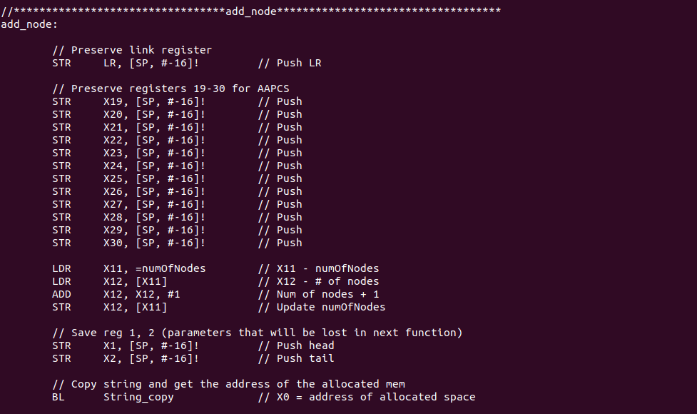

## The Task
While taking a course in assembly language we were tasked with a project that mimics a text editor. The task was to create a program that allowed users to add text via input or file, view, edit, delete, search, and save the text to a file. This project was done on a raspberry pi with arm64 architecture. I completed this project with a partner where we split the function amongst each other. Notably, this project built upon a previous project in the course that was about creating a string class that allowed a user to manipulate strings with various methods. Utilizing this initial string project we were able to call the functions we previously created while implementing the text editor. 

## Lessons Learned
Learning assembly and doing these projects forced me to gain a deeper understanding of how computers work on a lower level. Even outside of the context of assembly, these projects helped me improve upon analyzing and walking through code to understand it as it was easy to lose where you were at when coming back to working on the project. This also revealed to me the value in good coding practices, especially when working with other people. Without a doubt these projects were challenging in how tedious they were, though there was something fun about being so deeply focused on coding your project that you begin to lose track of your surroundings and your mind gets set into assembly mode for a while. 

## The Code
```
//********************************************************************************
// Programmer : Peijun Zhao/Juliette Raubolt
// RASM	      : 4
// Purpose    : It will be creating a Menu driver program that serves as a text 
//		editor and save the resulting text to a file
// Author     : Peijun Zhao/Juliette Raubolt
// Date	      : 11/29/2022
//********************************************************************************
// Algorithm
// Create different functions that will perform based on what the user has chosen 
// on a menu and creat a menu that will display the following:
//	<1> View all strings
//	<2> Add string
//    		<a> from Keyboard
//    		<b> from File. Static file named input.txt
//	<3> Delete string. Given an index #, delete the entire string and 
//	    de-allocate memory (including the node).
//	<4> Edit string. Given an index #, replace old string w/ new string. 
//	    Allocate/De-allocate as needed.
//	<5> String search. Regardless of case, return all strings that match 
//	    the substring given.
//	<6> Save File (output.txt)
//	<7> Quit
//********************************************************************************
// Function Alogorithms: 
//-------------------------------------------------------------------------------
// edit_node:
// Parameters: 
//	X0 - head
//	X1 - Node index to edit
//	X2 - Address of new string 
// Returns: 
//	Nothing, updates linked list
// 1. Call get_node with (index - 1) to get address of node 
// 2. LDR X0 with address in first 8 bytes of node and call free
// 3. STR the address of the new string into the first 8 bytes 
//-------------------------------------------------------------------------------
// search:
// Parameter:
//	X0 - Head of linked list
//	X1 - String to search for 
// Returns:
//	Nothing, outputs search results 
// 1. Set a counter = 1 (X21), and found_counter = 0 (X22)
// 2. X20 = traversal pointer = head 
// 3. Check if list is empty and output/exit accordingly
// 4. Get address of data in current node (X0 - first 8 bytes of node)
// 5. Call the String_indexof_3 
//    a - if returns a valid value then add the X21 counter to the found list
//	  and increment found counter
//    b - if not in the string then go to loop logic 
// 6. Loop logic - Go to next node and check if reached the end
// 7. End of searching loop 
// 8. Print the search summary line
// 9. Traverse the found list and call get_node on the line number given
// 10. Output the line anumber and dat enuber
//-------------------------------------------------------------------------------
// Save
// Traverse and write each to file 
//-------------------------------------------------------------------------------
// Exit
// 1. Branch to the end of the program 
//-------------------------------------------------------------------------------
// get_node:
// 1. Set X1 = index - 1
// 2. Set X2 = 0
// 3. Set traversal pointer (X0) = head 
// 4. Check if list is empty and return if so
// 4. Compare if X2 = X1
//    a - if = then exit
//    b - if not then get next node and start loop again (X0 = second 8 bytes)
//        but check if reached end of list 
//-------------------------------------------------------------------------------
// trav_search:
// 1. Set a counter to 1
// 2. X20 = travPtr = head
// 3. Check if list is empty, and if so then exit
// 4. Get address of data in the current node
// 5. Call substring function
//    a - If returns a valid value then add counter value to another list
//    b - If not then go to loop logic
// 6. Go to next node and check that have not reached end of list 
// 7. Once out of the loop traverse, traverse and output list returned 
//    - Get the count
//    - Output the message
//    - Get the index in the list and call get_node to get the node
//    - Output the contents 
//*******************************************************************************


	.EQU SIZE, 30720  // Used for getstring when obtaining user input
	
// File Modes 
.equ	READONLY,	00
.equ	WRITEONLY,	01
.equ	READWRITE,	02
.equ	CREATEWOT, 	01101
.equ	CREATEWOA,	02001
.equ	CREATERW,	0102
.equ 	AT_FDCWD,  	-100	

// File Perms 
.equ	RW_RW__,	0640

	.data
// Menu Strings 
szTE:		.asciz	"\n\t\tRASM4 TEXT EDITOR\n"
szMemCon:	.asciz	"\t Data Structure Heap Memory Consumption: "
szBytes:	.asciz	" bytes\n"
szNumNodes:	.asciz	"\t Number of Nodes: 0"
szOpt1:		.asciz	"\n<1> View all strings\n\n"
szOpt2:		.asciz	"<2> Add string\n"
szOpt2a:	.asciz	"\t<a> From Keyboard\n"
szOpt2b:	.asciz	"\t<b> From File. File name from user\n\n"
szOpt3:		.asciz	"<3> Delete string. Given am index #, delete the entire string and de-allocate memory (including the node)\n\n"
szOpt4:		.asciz	"<4> Edit string. Given and index #, replace old string w/ new string. Allocate/De-allocate as needed.\n\n"
szOpt5:		.asciz	"<5> String search. Regaurdless of case, return all strings that match the substring given.\n\n"
szOpt6:		.asciz	"<6> Save File. File name from user\n\n"
szOpt7:		.asciz	"<7> Quit\n\n"

// Input data
szIn1:		.asciz	"1"	// check user input
szIn2a:		.asciz	"2a"	// check user input
szIn2b:		.asciz	"2b"	// check user input
szIn3:		.asciz	"3"	// check user input
szIn4:		.asciz	"4"	// check user input
szIn5:		.asciz	"5"	// check user input
szIn6:		.asciz	"6"	// check user input
szIn7:		.asciz	"7"	// check user input
szLine:		.asciz  "Line "
szColon:	.asciz  ": "
headPtr:	.quad	0
tailPtr:	.quad	0
numOfNodes:	.quad 	0
dbHeapUsage:	.quad 	0
szInFilePrompt:	.asciz  "Enter input file name (name.txt): "
szOutFiPrompt:	.asciz	"Enter output file name (name.txt): "
szGetOpt:	.asciz	"Please select an option: "
szValidIn:	.asciz	"Please select a valid option: "
szSearchPrompt:	.asciz  "Enter a string to search for: "
szDelPromt:	.asciz  "Enter the line number to delete: "
szIndexPrompt:	.asciz	"Enter the line number to edit: "
szEditPrompt:	.asciz  "Enter the new string: "
szAddPrompt:	.asciz  "Enter the string to add: "
szEmpty:	.asciz  ""
szNewline:	.asciz  "\n"
szNodes:	.skip	21
szHeapUsage:	.skip	21
szConvert:	.skip	104
szLineNum:	.skip	21	// Store line num
szKbBuff:	.skip 	30720	// buffer for keyboard input
fileBuf: 	.skip 	30720    // buffer for file input
chLF:		.byte	0xa   	// Newline \n
chQt:		.byte 	0x22	// "

// File Locations
szOutFile:	.skip	21
szInFile:	.skip	21

	.global	_start
	.text

_start:	
//************************Called the menu to screen*******************************
Menu:
	LDR 	X0,=szTE		// point the address of the szTE to X0
	BL 	putstring 		// a void external function that print	

	LDR 	X0,=szMemCon		// poin the address of the szMemCon to X0
	BL 	putstring 		// a void external function that print the
					// c-sting of prompt

	LDR 	X0, =numOfNodes		// point address of numOfNodes to X0
	LDR	X0, [X0]
	LDR	X1, =szNodes		// X1 - store converted value
	BL	int64asc		// a function that will convert 

	LDR	X0, =numOfNodes		// X0 - numOfNodes
	LDR	X0, [X0]		// X0 - number of nodes
	MOV	X1, #16			// X1 - 16 for 16 bytes a node
	MUL	X0, X0, X1		// X0 - heap usage
	LDR	X2, =dbHeapUsage	// X2 - heap usage int
	STR	X0, [X2]		// Update heap usage
	LDR	X0, =dbHeapUsage	// var with value to convert
	LDR	X0, [X0]
	LDR	X1, =szHeapUsage	// var to store conversion
	BL	int64asc		// Convert to ascii

	LDR	X0, =szHeapUsage	// Load heap usage to print
	BL	putstring		// Print heap usage

	// Output menu info
	LDR 	X0,=szBytes		// poin the address of the szBytes to X0
	BL 	putstring 		// a void external function that print the
					// c-sting of prompt
	
	LDR 	X0,=szNumNodes		// poin the address of szNumNodes to X0
	BL 	putstring 		// a void external function that print the
					// c-sting of prompt
	
	// get the number of nodes
	LDR 	X0,=szNodes		// point address of numOfNodes to X0
	BL 	putstring 		// a void external function that print 	
	
	LDR 	X0,=szOpt1		// poin the address of the szOpt1 to X0
	BL 	putstring 		// a void external function that print 
	
	LDR 	X0,=szOpt2		// poin the address of the szOpt2 to X0
	BL 	putstring 		// a void external function that print 
	
	LDR 	X0,=szOpt2a		// poin the address of the szOpt2a to X0
	BL 	putstring 		// a void external function that print the 
					// c-sting of prompt
	
	LDR 	X0,=szOpt2b		// poin the address of the szOpt2b to X0
	BL 	putstring 		// a void external function that print the
					// c-sting of prompt
	
	LDR 	X0,=szOpt3		// poin the address of the szOpt3 to X0
	BL 	putstring 		// a void external function that print
	
	LDR 	X0,=szOpt4		// poin the address of the szOpt4 to X0
	BL 	putstring 		// a void external function that print the					 
	LDR 	X0,=szOpt5		// poin the address of the szOpt5 to X0
	BL 	putstring 		// a void external function that print the 					  
	LDR 	X0,=szOpt6		// poin the address of the szOpt6 to X0
	BL 	putstring 		// a void external function that print the 				 	 
	LDR 	X0,=szOpt7		// poin the address of the szOpt7 to X0
	BL 	putstring 		// a void external function that print the 					 
//**********************Get user input and error checking*************************
	LDR 	X0,=szGetOpt		// poin the address of the szGetOpt to X0
	BL 	putstring 		// a void external function that print the
	
getInput:	
	LDR	X0, =szKbBuff		// Load address  of the szKbBuff to X0
	MOV	X1, #SIZE		// Load max input size	
	BL	getstring		// a external function that get user input
	
	// option 1
	LDR 	X0,=szKbBuff		// Load address  of the szKbBuff to X0
	LDR 	X1,=szIn1		// Load address  of the szIn1 to X1
	BL 	String_equalsIgnoreCase	// compare the two strings
	
	CMP 	X0,#1			// compara if the two string is equal
	B.EQ 	View_String		// if equal call View_String
	
	// option 2a
	LDR 	X0,=szKbBuff		// Load address  of the szKbBuff to X0
	LDR 	X1,=szIn2a		// Load address  of the szIn2a to X1
	BL  	String_equalsIgnoreCase	// compare the two strings
	
	CMP 	X0,#1			// compara if the two string is equal
	B.EQ 	Add_KbString		// if equal call Print_KbString
	
	// option 2b
	LDR 	X0,=szKbBuff		// Load address  of the szKbBuff to X0
	LDR 	X1,=szIn2b		// Load address  of the szIn2b to X1
	BL  	String_equalsIgnoreCase	// compare the two strings
	
	CMP 	X0,#1			// compara if the two string is equal
	B.EQ 	Add_File		// if equal call Print_File
	
	// option 3
	LDR 	X0,=szKbBuff		// Load address  of the szKbBuff to X0
	LDR 	X1,=szIn3		// Load address  of the szIn3 to X1
	BL  	String_equalsIgnoreCase	// compare the two strings
	
	CMP 	X0,#1			// compara if the two string is equal
	B.EQ 	Delete_String		// if equal call Delete_String
	
	// option 4
	LDR 	X0,=szKbBuff		// Load address  of the szKbBuff to X0
	LDR 	X1,=szIn4		// Load address  of the szIn4 to X1
	BL  	String_equalsIgnoreCase	// compare the two strings
	
	CMP 	X0,#1			// compara if the two string is equal
	B.EQ	edit_node		// if equal call edit
	
	// option 5
	LDR 	X0,=szKbBuff		// Load address  of the szKbBuff to X0
	LDR 	X1,=szIn5		// Load address  of the szIn5 to X1
	BL  	String_equalsIgnoreCase	// compare the two strings
	
	CMP	X0,#1			// compara if the two string is equal
	B.EQ	search			// if equal call search
	
	// option 6
	LDR 	X0,=szKbBuff		// Load address  of the szKbBuff to X0
	LDR 	X1,=szIn6		// Load address  of the szIn6 to X1
	BL  	String_equalsIgnoreCase	// compare the two strings
	
	CMP 	X0,#1			// compara if the two string is equal
	B.EQ	save			// if equal call save
	
	// option 7
	LDR 	X0,=szKbBuff		// Load address  of the szKbBuff to X0
	LDR 	X1,=szIn7		// Load address  of the szIn7 to X1
	BL  	String_equalsIgnoreCase // compare the two strings
	
	CMP 	X0,#1			// compara if the two string is equal
	B.EQ 	exit			// if equal call exit

	// if the user has enter a invalid input
	LDR 	X0,=szValidIn		// Load address of the szValidIn to X0
	BL 	putstring 		// a void external function that print the 	

	B	getInput		// branch to get the user input agin
	
	LDR 	X0,=chLF		// Load address of the chLF to X0
	BL	putch			// output string
	
//******************************View all the string*******************************
View_String:
	LDR 	X0,=headPtr		// poin the address of headPtr to X0
	BL	traverse_print		// Traverse through and print
	
	B	Menu			// Go to the menu

//******************************adding form keyboard******************************
Add_KbString:

	// Prompt for the stirng
	LDR	X0, =szAddPrompt	// Load prompt to print
	BL	putstring		// print prompt
	
	LDR	X0, =szKbBuff		// Load address  of the szKbBuff to X0
	MOV	X1, #SIZE		// Load max input size	
	BL	getstring		// a external function that get user input
	
	LDR	X0, =szKbBuff		// X0 - input
	BL	String_Length		// Get the length of the input
	MOV	X1, 0xa			// X1 - newline
	LDR	X2, =szKbBuff		// X2 - input
	STR	X1, [X2, X0]		// Add newline to input
	LDR	X0, =szKbBuff		// X0 - input for sttr copy
	BL	String_copy		// X0 - allocate string
	MOV	X20, X0			// Save allocated mem address

	LDR	X1, =headPtr		// X1 - head
	LDR	X2, =tailPtr		// X2 - tail
	BL	add_node		// Add node to linked list
	
	MOV	X0, X20			// X0 - allocated mem
	BL	free			// Free the allocated mem

	B 	Menu			// Go to the menu 

//****************************adding string list form file************************
Add_File:
	// Prompt the user for a file name 
	LDR	X0, =szInFilePrompt	// Load prompt to print
	BL	putstring		// print prompt
	
	LDR	X0, =szKbBuff		// Load address  of the szKbBuff to X0
	MOV	X1, #SIZE		// Load max input size	
	BL	getstring		// Get input	

    	//***************open file*******************
    	MOV 	X0, #AT_FDCWD    	// load directory
    	MOV 	X8, #56       	 	// OpenAt
    	LDR 	X1, =szKbBuff		// file name
   	MOV 	X2, #READONLY       	// flags
    	MOV 	X3, #RW_RW__	  	// file permissions
    	SVC 	0               	// service call  
	// X0 = fd (return value)
	MOV	X20, X0			// Save for the close file later 
	STR	X20, [SP, #-16]!	// Push fd

	// Read File
	MOV	X0, X20			// X0 - fd
    	MOV 	X2, #30720        	// File input buffer size
	LDR	X1, =szKbBuff		// X1 - input buffer
	MOV	X8, #63 		// READ
    	SVC	0			// Service call
   
	// Loop initializations
	MOV	X20, X0			// X20 - length of input
	MOV	X22, #0			// X22 - loop counter
	MOV	X23, #0			// X23 - insert index (for str)
read_loop:	
	LDR	X2, =szKbBuff		// X2 = file input
	LDRB	W0, [X2, X22]		// Get one byte of the input
	
	CMP	W0, 0xa			// Check if end of line
	B.EQ	convert			// If end of line then create a node

	LDR	X1, =szConvert		// X1 - hold the string to be made node
	STR	X0, [X1, X23]		// Store the loaded byte
	ADD	X23, X23, #1		// Increment to updated pos

read_logic:
	ADD	X22, X22, #1		// Increment loop counter
	CMP	X22, X20		// Check if processed all of input
	B.LT	read_loop		// If less than then keep looping
	B	read_end		// If processed all then end

convert:
	LDR	X1, =szConvert		// X1 - hold the string to be made node
	MOV	X0, 0xa
	STR	X0, [X1, X23]		// Store the loaded byte
	ADD	X23, X23, #1		// Increment to updated pos

	LDR	X1, =szConvert
	MOV	X0, 0x00
	STR	X0, [X1, X23]
	
	MOV	X23, #0			// Restore storing index
	LDR	X0, =szConvert		// X0 - one line from file
	 
	LDR	X1, =headPtr		// X1 - head
	LDR	X2, =tailPtr		// X2 - tail
	BL	add_node		// Add node to linked list

	MOV	X1, 0x00		// Load an empty string
	LDR	X2, =szConvert		// Load the dummy string
	STR	X1, [X2]		// Clear dummy string
	STR	X1, [X2, #8]		// Clear dummy string
	STR	X1, [X2, #16]		// Clear dummy string
	STR	X1, [X2, #24]		// Clear dummy string
	STR	X1, [X2, #32]		// Clear dummy string
	STR	X1, [X2, #40]		// Clear dummy string
	STR	X1, [X2, #48]		// Clear dummy string
	STR	X1, [X2, #56]		// Clear dummy string
	STR	X1, [X2, #64]		// Clear dummy string
	STR	X1, [X2, #72]		// Clear dummy string
	STR	X1, [X2, #80]		// Clear dummy string
	STR	X1, [X2, #88]		// Clear dummy string
	STR	X1, [X2, #96]		// Clear dummy string
	
	B	read_logic		// Branch to loop logic
	
read_end:
	LDR	X0, [SP], #16		// X0 - fd
	MOV	X8, #57			// CLOSE
	SVC	0			// Service call
	
	B 	Menu


//*********************************Delete a string********************************
Delete_String:
	LDR	X11, =numOfNodes	// X11 - numOfNodes
	LDR	X12, [X11]		// X12 - # of nodes
	SUB	X12, X12, #1		// Num of nodes + 1 
	STR	X12, [X11]		// Update numOfNodes

	LDR 	X0,=szDelPromt		// load the promt to print
	BL	putstring		// Print prompt
	
	LDR	X0, =szKbBuff		// Load address  of the szKbBuff to X0
	MOV	X1, #SIZE		// Load max input size	
	BL	getstring		// a external function that get user input
	
	LDR	X0, =szKbBuff		// Load input to convert to int
	BL	ascint64		// Convert to int
	MOV	X20, X0			// Save for later	

	MOV	X1, X0			// X1 - index to get
	LDR	X0, =headPtr		// X0 - head
	BL	get_node		// X0 - current node 
	MOV	X21, X0			// Save address for later

	LDR	X1, =headPtr		// X1 - head 
	LDR	X1, [X1]		// X1 - addr of 1st node
	CMP	X0, X1			// Chcek if deleting first node
	B.EQ	delete_head		// Special case delete head

	SUB	X1, X20, #1		// Previous node is index - 1
	LDR	X0, =headPtr		// X0 - head
	BL	get_node		// Get previous node
	MOV	X23, X0			// Save for later
	LDR	X3, [X21, #8]		// X3 - Next of current node
	STR	X3, [X0, #8]		// Update prev node's next

	LDR	X1, =tailPtr		// X1 - tail
	LDR	X1, [X1]		// X1 - addr of tail
	CMP	X21, X1			// Check if deleting tail
	B.NE	delete_free		// Special case delete tail

	LDR	X24, =tailPtr		// X4 - tail
	STR	X23, [X24]		// Tail = prev	

delete_free:
	LDR	X0, [X21]		// X0 - address of data
	BL	free			// Free data

	MOV	X0, X21			// X0 - address of node
	BL 	free			// free node

	B	Menu			// Return to menu

delete_head: 
	// Get the next and set head to that
	LDR	X3, [X21, #8]		// Get next address
	LDR	X1, =headPtr		// X1 - head
	STR	X3, [X1]		// head = next node
	
	B 	delete_free

//**********************************Edit a string*********************************
edit_node:
	LDR	X0, =szIndexPrompt	// Load index prompt to print
	BL	putstring		// Print prompt	

	LDR	X0, =szKbBuff		// Load address  of the szKbBuff to X0
	MOV	X1, #SIZE		// Load max input size	
	BL	getstring		// a external function that get user input
	
	LDR	X0, =szKbBuff		// Load input to convert to int
	BL	ascint64		// Convert to int
	
	MOV	X1, X0			// X1 - index to get
	LDR	X0, =headPtr		// X0 - head
	BL	get_node

	STR	X0, [SP, #-16]!		// Push X0 - address of node
	LDR	X0, [X0]		// X0 - address of current data
	BL	free			// Free that mem

	LDR	X0, =szEditPrompt	// Load edit prompt to print
	BL	putstring		// Print prompt	

	LDR	X0, =szKbBuff		// Load address  of the szKbBuff to X0
	MOV	X1, #SIZE		// Load max input size	
	BL	getstring		// a external function that get user input
	
	LDR	X0, =szKbBuff		// X0 - input
	LDR	X1, =szNewline		// X1 - newline
	BL	String_concat		// X0 - allocate string
	
	LDR	X1, [SP], #16		// Pop X1 - address of node
	STR	X0, [X1]		// Store the new string

	B	Menu			// Go to menu
//********************************Search for a string*****************************
search:
	LDR	X0, =szSearchPrompt	// Load prompt to print
	BL	putstring		// Print search prompt

	LDR	X0, =szKbBuff		// Load address  of the szKbBuff to X0
	MOV	X1, #SIZE		// Load max input size	
	BL	getstring		// a external function that get user input

	LDR	X0, =headPtr		// X0 - headprt
	LDR	X1, =szKbBuff		// X1 - buffer with input

	BL	trav_search		// Call traverse and search

	B	Menu			// Go to menu

//********************************Save to output file*****************************
save:
	// Prompt the user for a file name 
	LDR	X0, =szOutFiPrompt	// Load prompt to print
	BL	putstring		// print prompt
	
	LDR	X0, =szKbBuff		// Load address  of the szKbBuff to X0
	MOV	X1, #SIZE		// Load max input size	
	BL	getstring		// Get input	
	
	// Open file 
	MOV X0, #AT_FDCWD               // dfd for openat
	MOV X8, #56                     // OPENAT
	LDR X1, =szKbBuff		// file name
	MOV X2, #CREATEWOT              // flags
	MOV X3, RW_RW__                 // mode
   	SVC 0                           // service call
	// X0 = fd (return val)
	MOV	X20, X0			// Save for the close later

	// Traverse and write to file 
	LDR	X0, =headPtr		// X0 - head
	LDR	X21, [X0]		// X20 = travPtr = head
	CMP	X20, #0			// Check if list is empty
	B.eq	end_save		// If empty then done

write_loop:
	LDR	X0, [X21]		// address of data in node
	MOV	X22, X0			// Save address for later
	BL	String_Length		// Get length of string
	MOV	X2, X0			// X2 - length of message to write
	MOV	X1, X22			// X1 - message to write
	MOV	X0, X20			// X0 - fd
	MOV	X8, #64			// WRITE
	SVC	0			// Service call
	
	LDR	X21, [X21, #8]		// Get address of next node
	CMP	X21, #0			// Check is equals null (end of list)
	B.EQ	end_save		// If end then finished saving
	B	write_loop		// If not then start loop over

end_save:
	// Close file 
	MOV	X0, X20			// X0 = fd
	MOV	X8, #57			// CLOSE
	SVC	0			// Service call

	B	Menu			// Go to menu

//********************************Get a specified node****************************
// X0 - headPtr
// X1 - index to get to 
get_node: 
	SUB	X1, X1, #1		// X1 = index - 1 (to account for 0)
	MOV	X2, #0			// X2 = counter = 0
	LDR	X0, [X0]		// X0 = travPtr = head
	CMP	X0, #0			// Check for empty list
	B.EQ	found_node		// If empty then done

get_start:
	CMP	X2, X1			// Check if X2 = X1 (reached node)
	B.EQ	found_node		// Finish if found

	ADD	X2, X2, #1		// Increment counter
	LDR	X0, [X0, #8]		// Get address of next node
	CMP	X0, #0			// Check if equals null (end trav)
	B.EQ	found_node		// Reached end of list without finding
	B	get_start		// Start loop again

found_node:
	RET				// Return to caller

//********************************Traverse and Search*****************************
// X0 - headPtr
// X1 - string to search for
trav_search:
	// Preserve link register
	STR	LR, [SP, #-16]!		// Push LR
	STR	X0, [SP, #-16]!		// Push X0 - head ptr


	// Copy search stirng and convert to lower
	MOV	X0, X1			// X0 - string to search for
	BL	String_copy		// Copy string
	MOV	X22, X0			// Save address for later 
	BL	String_toUpperCase	// Convert to lowercase

	MOV	X21, #1			// Counter = 1 (line/string 1)
	LDR	X0, [SP], #16		// Pop X0 - head ptr
	STR	X22, [SP, #-16]!	// Push allocated mem address
	LDR	X20, [X0]		// X20 = travPtr = head
	CMP	X20, #0			// Check if list is empty
	B.EQ	end_trav		// If empty end the traversal

trav_start:
	LDR	X0, [X20]		// X0 - string to search (data of node) 
	MOV	X23, X0			// Save address of string data
	BL	String_copy		// Copy string
	MOV	X24, X0
	BL	String_toUpperCase	// Convert to lowercase

	MOV	X1, X22			// X1 - what to search for (passed in)
	BL	String_lastIndexOf_3	// Check to see if string is found
	STR	X0, [SP, #-16]!		// Push index of results
	
	MOV	X0, X24			// Addr of duplicate to lower string
	BL	free			// Free the mem
	
	LDR	X0, [SP], #16		// Pop X0 - index of results
	CMP	X0, #-1			// If = -1 then not found
	B.NE	found			// If != -1 then found so add and cont 
	
loop_logic:
	ADD	X21, X21, #1		// Increment the current line
	LDR	X20, [X20, #8]		// Get address of next node
	CMP	X20, #0			// Check if equals null, end trav
	B.EQ	end_trav		// If reached end then end traversal
	B	trav_start		// Start loop again if not at end

found:
	LDR	X0, =szLine		// Load "Line" to print
	BL	putstring		// Print Line

	MOV	X0, X21			// X0 = line num
	LDR	X1, =szLineNum		// To store ascii line
	BL	int64asc		// Convert to ascii
	
	LDR	X0, =szLineNum		// Load LineNum to print
	BL	putstring		// Print lineNum 

	LDR	X0, =szColon		// Load ": " to print
	BL	putstring		// Print colon

	MOV	X0, X23			// X0 = data to print
	BL	putstring		// Print found string

	B	loop_logic		// Return to loop 

end_trav:
	LDR	X0, [SP], #16		// Pop mem addr
	BL	free			// Free the mem
	LDR	LR, [SP], #16 		// Pop LR
	RET				// Return to caller


//*********************************add_node***********************************
add_node:

	// Preserve link register
	STR	LR, [SP, #-16]!		// Push LR
	
	// Preserve registers 19-30 for AAPCS
	STR	X19, [SP, #-16]!	// Push
	STR	X20, [SP, #-16]!	// Push
	STR	X21, [SP, #-16]!	// Push
	STR	X22, [SP, #-16]!	// Push
	STR	X23, [SP, #-16]!	// Push
	STR	X24, [SP, #-16]!	// Push
	STR	X25, [SP, #-16]!	// Push
	STR	X26, [SP, #-16]!	// Push
	STR	X27, [SP, #-16]!	// Push
	STR	X28, [SP, #-16]!	// Push
	STR	X29, [SP, #-16]!	// Push
	STR	X30, [SP, #-16]!	// Push

	LDR	X11, =numOfNodes	// X11 - numOfNodes
	LDR	X12, [X11]		// X12 - # of nodes
	ADD	X12, X12, #1		// Num of nodes + 1 
	STR	X12, [X11]		// Update numOfNodes

	// Save reg 1, 2 (parameters that will be lost in next function)
	STR	X1, [SP, #-16]!		// Push head
	STR	X2, [SP, #-16]!		// Push tail

	// Copy string and get the address of the allocated mem
	BL	String_copy		// X0 = address of allocated space

	// Create a node that stores the string and points to null
	B	create_node		// Create a node

end_create:
	// Unload the head, tail, and size for the insertion
	LDR	X2, [SP], #16		// Pop tail
	LDR	X1, [SP], #16		// Pop head

	LDR	X3, [X1]		// X3 = head	
	CMP	X3, #0			// If head = 0 then list is empty
	B.NE	insert_node		// If not empty then add like normal
	// If empty then to insert just set the head and tail equal to new node 
	STR	X0, [X1]		// head = new node	
	STR	X0, [X2]		// tail = new node

end_insert:
	LDR	X30, [SP], #16		// Pop
	LDR	X29, [SP], #16		// Pop
	LDR	X28, [SP], #16		// Pop
	LDR	X27, [SP], #16		// Pop
	LDR	X26, [SP], #16		// Pop
	LDR	X25, [SP], #16		// Pop
	LDR	X24, [SP], #16		// Pop
	LDR	X23, [SP], #16		// Pop
	LDR	X22, [SP], #16		// Pop
	LDR	X21, [SP], #16		// Pop
	LDR	X20, [SP], #16		// Pop
	LDR	X19, [SP], #16		// Pop

	LDR	LR, [SP], #16 		// Pop LR
	RET				// Return to caller

create_node:
	STR	X1, [SP, #-16]!		// Push head
	STR	X2, [SP, #-16]!		// Push tail
	STR	X0, [SP, #-16]!		// Push string address

	MOV	X0, #16			// Allocate 16 bytes
	BL	malloc			// X0 is holding the address of newnode
	
	LDR	X1, [SP], #16		// Pop string address
	STR	X1, [X0]		// Set node to have the data address
	MOV	X1, #0			// Set upper 8 bytes to 0
	STR	X1, [X0, #8]		// Next node address = 0 since new tail

	LDR	X2, [SP], #16		// Pop head
	LDR	X1, [SP], #16		// Pop tail
	B	end_create		// Return back to main flow

insert_node:
	LDR	X3, [X2]		// X3 = address of last node of list
	STR	X0, [X3, #8]		// last node pointer = new node
	STR	X0, [X2]		// tail = new node
	B	end_insert		// Return back to main flow

//******************************************************************************

//*****************************traverse_print********************************
traverse_print:
	// Preserve link register
	STR	LR, [SP, #-16]!		// Push LR

	LDR	X20, [X0]		// X20 = travPtr = head

	CMP	X20, #0			// Check if list is empty
	B.eq	end_traverse		// If so exit since nothing to print

	MOV	X22, #1			// Line counter
loop_start:
	LDR	X0, =szLine		// Load "Line" to print
	BL	putstring		// Print Line

	MOV	X0, X22			// X0 = line num
	LDR	X1, =szLineNum		// To store ascii line
	BL	int64asc		// Convert to ascii
	
	LDR	X0, =szLineNum		// Load LineNum to print
	BL	putstring		// Print lineNum 

	LDR	X0, =szColon		// Load ": " to print
	BL	putstring		// Print colon

	LDR	X0, [X20]		// X0 = address of data in node
	BL	putstring		// Print the string

//	LDR	X0, =chLF		// Load newline to print
//	BL	putch			// Print newlinw

	ADD	X22, X22, #1		// Increment line
	LDR	X21, [X20, #8]		// Get address of nex node
	CMP	X21, #0			// Check if equals null (end of trav)
	B.EQ	end_traverse		// If done then go to end of function

	LDR	X20, [X20, #8]		// X20 = address of next node
	B	loop_start		// Start printing loop again
end_traverse:

	LDR	LR, [SP], #16 		// Pop LR
	RET				// Return to caller

//****************************************************************************
//*********************************End the program********************************
exit:
	LDR	X1, =headPtr		// X1 - head 
	LDR	X1, [X1]		// X1 - addr of 1st node
	MOV	X21, X1
	CMP	X1, #0			// If equal then nothing to delete
	B.EQ	done_delete		// Done deleting

	// Get the next and set head to that
	LDR	X3, [X21, #8]		// Get next address
	LDR	X1, =headPtr		// X1 - head
	STR	X3, [X1]		// head = next node

	LDR	X0, [X21]		// X0 - address of data
	BL	free			// Free data

	MOV	X0, X21			// X0 - address of node
	BL 	free			// free node
	
	B	exit	

done_delete:

	// Set up parameters to exit and call linux
	MOV 	X0, #0		// Use 0 for return code
	MOV	X8, #93		// Service command code #93 to terminate program 
	SVC	0		// Call linux to terminate 

	.end	
```
